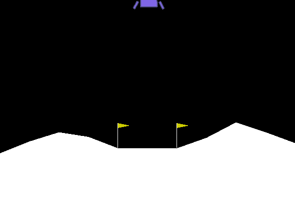
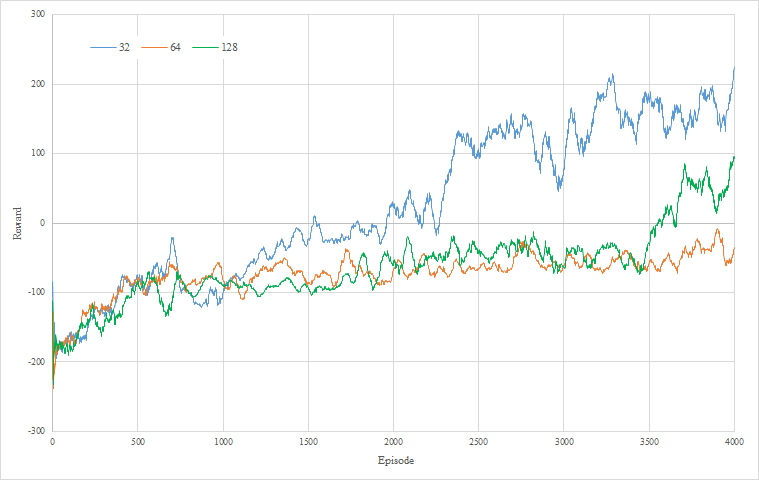
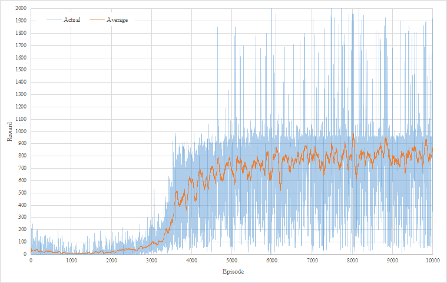
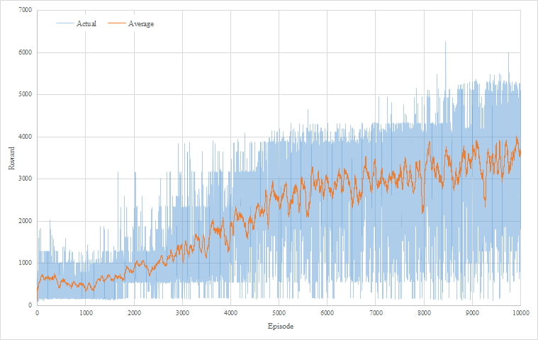

# DDDQN
Basic implementation of a Dueling Double Deep Q Network (DDDQN) algorithm using TensorFlow 2.0 and OpenAI Gym Retro. Super basic, does not include things like soft update, prioritized experience replay, etc ...
  The papers are found here:
  [Deep Reinforcement Learning with Double Q-learning](https://arxiv.org/abs/1509.06461)
  [Dueling Network Architectures for Deep Reinforcement Learning](https://arxiv.org/abs/1511.06581)

# Notes
TensorFlow 2.1, OpenAI Gym, and Gym Retro are required.
A Lunar Lander version is provided that does not need a rom otherwise rom files are not included due to copyright concerns.
You need to provide your own. The ones I used are:
1. Joust (USA).nes
2. Ms. Pac-Man (USA).nes
3. Space Invaders (Japan).nes
4. Super Mario Bros. (World).nes

# Usage
Run main.py, be sure to install your roms (code to install roms is provided, rom is not).
Run lunar.py to train on Lunar Lander Gym environment.
There are various lines of codes that shows examples on how to create agent, train agent with checkpoints, load models, and play games.
Models for the various checkpoints shown below are provided in the models directory.

# Work In Progress
Currently the implentation works well in tests but hyperparameters have not been tuned.

## Lunar Lander
Ran three times for 4,000 epsiodes for 32, 64, and 128 batch sizes.
Epsilon decay was set to 0.99999. All other hyperparameters were kept as the default value I set.

| Episode 100   | Episode 2000  | Episode 3800  |
| ------------- | ------------- | ------------- |
|  |  |  |

## Space Invaders
Ran once for 10,000 epsiodes.
Batch size was set to 32 and epsilon decay was set to 0.99999. All other hyperparameters were kept as the default value I set.
| Episode 100   | Episode 4000  | Episode 8800  |
| ------------- | ------------- | ------------- |
|  |  |  |

## Super Mario Bros
Ran once for 10,000 epsiodes.
Batch size was set to 32 and epsilon decay was set to 0.99999. All other hyperparameters were kept as the default value I set.
| Episode 100   | Episode 4500  | Episode 8500  |
| ------------- | ------------- | ------------- |
|  |  |  |

